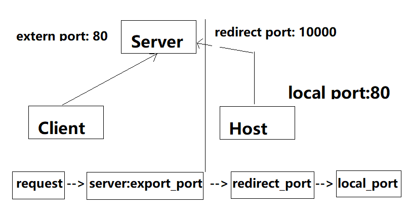

# socat wrapper

## 简介
该项目很简单，就是个 socat 的进程管理器，用来做内网穿透用，本身没有实现 SSH，是通过单独起一个 socat 进程来实现端口转发。其转发原理如图所示：

## 环境
当前仅支持Linux，当然Windows也是支持的，但是作者对Windows环境变量之类的参数不熟练，所以暂时没有支持，实际上只要安装了socat就可以使用该库了。

在 Linux 下，需要安装socat，作者本人开发机是 ubuntu，下面给出 ubuntu 的安装命令:
```sh
sudo apt install socat -y
```
其他系统请使用自己的包安装器安装。
## 客户端上下线
客户端连接和断开会有事件，打印出来看看：
```
连接: accepting connection from AF=2 10.55.23.58:3404 on AF=2 10.55.23.58:60001
断开: childdied(): handling signal 17
```
监听文本变化即可实现监控。
## 示例
```go
package socatwrapper

import (
	"context"
	"testing"
	"time"
)

func TestSocatServer(t *testing.T) {
	server := NewSocatServer(60000, 60000+100)
	port, err := server.StartTunnel(context.WithCancel(context.Background()))
	if err != nil {
		t.Fatal(err)
	}
	time.Sleep(28 * time.Second)
	server.StopTunnel(port)
}
func TestSocatClient(t *testing.T) {
	client := NewSocatClient("127.0.0.1", 60000, 2580)
	err := client.StartTunnel(context.WithCancel(context.Background()))
	if err != nil {
		t.Fatal(err)
	}
	time.Sleep(28 * time.Second)
	client.Stop()
}

```